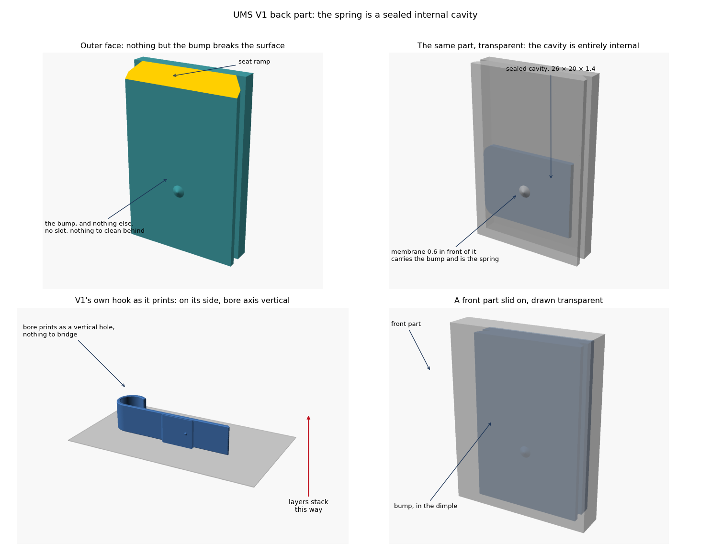
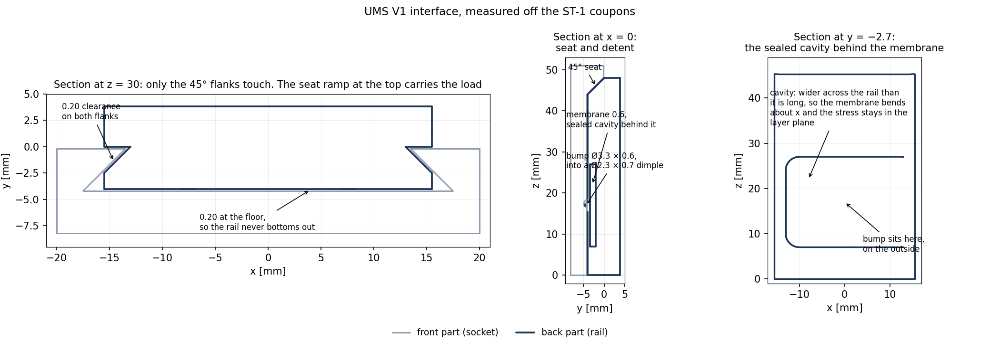

> **Revised in ST-8.** The membrane is now **0.90** and the cavity **24** long:
> 0.60 is one perimeter and gap fill on a 0.4 nozzle, and the fill showed on the
> face. Strain and click are unchanged. See `docs/ST8_report.md`.

# UMS V1 — ST-1 report: the interface library

**September 2026 · `lib/ums_iface.scad` v0.1.0 · OpenSCAD 2021.01**

ST-1 is the single source of truth for the V1 slide interface. Everything in ST-2
onwards (the hook, the vertical clip, the flat plate, the front blank and the
UniHolder adapter) draws its geometry from this one file, so there is no second
place where a number can drift.





---

## 1. Delivered

| File | What it is |
|---|---|
| `lib/ums_iface.scad` | The interface: masters, derived geometry, `ums_rail()`, `ums_socket_cutter()`, checks, self-test |
| `tests/ums_iface_coupon.scad` | Coupon with eight parts: `rail`, `socket`, `mate`, `cut`, `probe`, `snap`, `v1probe`, `v1snap` |
| `tests/st1_variants.json` | 13 variants, rendered at 60° and 45° |
| `tools/check_interface.py` | Measures a rendered STL and compares it against the V1 numbers |
| `tools/plot_section.py` | Plots the sections above straight out of the rendered STLs |
| `lib/uh_core.scad`, `lib/uh_shapes.scad`, `tools/check_overhang.py`, `tools/render_matrix.py` | Vendored from UniHolder v0.4, byte-identical (md5 verified). Nothing in the UniHolder project is touched |

---

## 2. Verification

### 2.1 Geometry measured back off the rendered STLs

Every V1 number from the design plan, read back out of the STL that OpenSCAD
produced. Tolerance 0.05 mm, 0.15 mm on the two detent diameters that the plan
marks as approximate, 0.10° on angles.

| Rail | measured | V1 | | Socket | measured | V1 |
|---|---|---|---|---|---|---|
| height | 4.000 | 4.00 | | mouth offset from root plane | 0.200 | 0.20 |
| tip width | 31.000 | 31.00 | | depth | 4.000 | 4.00 |
| root width | 26.034 | 26.04 | | mouth width | 27.000 | 27.00 |
| flank run | 2.483 | 2.48 | | floor width | 35.000 | 35.00 |
| flank angle | 45.000° | 45° | | flank angle | 45.000° | 45° |
| full section | 34.000 | 34.00 | | seat ramp | 4.000 / 45.000° | 4.00 / 45° |
| seat ramp | 4.000 / 45.000° | 4.00 / 45° | | dimple | 0.700 deep, Ø2.298 | 0.70, Ø2.30 |
| bump | 1.000 high, Ø3.300 | 1.00, Ø3.30 | | dimple below floor top | 26.580 | 26.58 |
| bump below tip top | 27.000 | 27.00 | | flank mirror error | 0.000 | 0.00 |
| flank mirror error | 0.000 | 0.00 | | | | |

**Both PASS, every line.** Largest deviation anywhere is 0.014 mm, on the root
width, which is rounding in V1's own model: the exact value for a 0.20 clearance
is 26.0343 and the STEP reads 26.04.

### 2.2 Fit against an independent V1 reference

`v1probe` intersects the generated rail with a front-part block whose groove is
written out in literal numbers taken off the V1 STEP models, derived from nothing
in the library. An empty intersection means the rail fits a real V1 front part.

| Case | Result | Detent interference |
|---|---|---|
| V1 default, clearance 0.20 | empty — fits | 0.798 mm³ |
| clearance 0.10 | empty — fits | 0.798 mm³ |
| clearance 0.40 | empty — fits | 0.798 mm³ |
| clearance 0.00 | **clash** | 28.8 mm³ |
| 34 mm rail in a 38 mm V1 socket | empty — fits | 0.798 mm³ |
| 60 mm rail in a 38 mm V1 socket | empty — fits | 0.798 mm³ |
| 38 mm rail in a 72.5 mm V1 socket (the humidifier holder) | empty — fits | 0.798 mm³ |

Two things worth reading off that table. First, the clearance-0 row clashing is
the point: the probe is sensitive, so the empty rows mean something. Second, the
interference is **0.798 mm³ in every case that fits** — that is the detent and
nothing else, and it stays identical whatever the two lengths are, because both
the bump and the dimple are dimensioned from the seat at the top rather than from
the bottom of the part.

### 2.3 Printability

13 variants × 2 limits = 26 renders, all **PASS** on P2 (overhang), P3 (no
floating minimum) and manifoldness.

* Worst overhang on the rail: **35.0°**, the detent bump. V1's own bump is about
  36°, so this matches the original and leaves headroom at 45.
* Worst overhang on the socket: **45.0°**, the seat ramp. That is V1's angle and
  it is fixed by compatibility, so `max_overhang = 40` is not available to any UMS
  part. The Customizer range stays 45–60.
* The guard works: at a 28 mm interface the detent is dropped with a console
  warning rather than being squeezed into the seat.

### 2.4 One bug found and fixed

The first socket profile had a vertical wall where the right-hand 45° flank
should have been — a mirrored vertex that was wrong in both the library and the
literal V1 reference block. It passed the numeric check, because the checker read
one flank and assumed the other matched, and it passed the fit probe, because a
wider groove still swallows the rail. The section plot showed it immediately.
Fixed in both places, and `check_interface.py` now measures both flanks and
reports a mirror error, so the same class of mistake cannot pass again.

---

## 3. Decisions from your review

| Q | Decision | Where it lands |
|---|---|---|
| Q1 | Flat wall plate is **in**, as a third `attach` mode. Two screws in a vertical column, designed from scratch. No safety latch in V1 | ST-2 |
| Q2 | Reproduce V1's detent exactly — the bump is deliberately larger than the dimple and offset 0.42 from it, so it wedges on the rim and preloads the joint. Your hook has to work with front parts already printed, whose dimples are fixed, so copying is the only option that keeps them interchangeable. All five figures are parameters | done in ST-1 |
| Q3 | Teardrop bore crown **on by default**, plain circle available. The tube then seats on two lines either side of a shallow peak instead of one line under a bridged arch | ST-2 |
| Q4 | Vendored copies, byte-identical, verified by md5. The UniHolder project is not modified in any way | done in ST-1 |
| Q5 | Adapter fixings are **customisable slots** — length, count and pitch all parameters | ST-5 |
| Q6 | Not answered. ST-1 supports any length; 38 stays the default and the console warns off it. Nothing downstream is blocked either way | open |

**Tube range: 15–50 mm**, noted. That replaces the 8–80 guess in the plan, so
`tube_d` gets range `[15:0.5:50]` and the variant matrix for ST-2 will be built
on 15, 19, 25, 32, 40 and 50.

One consequence worth flagging now: at 15 mm the hook bore is 15 mm across while
the rail behind it is 31 mm wide and 4 mm deep. The hook throat is narrower than
the plate, so for the smallest sizes the plate will overhang the hook on both
sides. That is cosmetic rather than structural, but it does mean the small end of
the range wants a check that the hook wall does not undercut the rail root. I
have put it in ST-2's done-when list.

---

## 4. Using it

```
# render and check a coupon
openscad -o out/rail.stl -D 'part="rail"' tests/ums_iface_coupon.scad
python3 tools/check_interface.py out/rail.stl --part rail

# the whole matrix at both overhang limits
python3 tools/render_matrix.py tests/ums_iface_coupon.scad tests/st1_variants.json --limits 60 45

# does the rail fit a real V1 front part? (OpenSCAD must report an empty object)
openscad -o out/probe.stl -D 'part="v1probe"' tests/ums_iface_coupon.scad
```

For ST-2 the whole interface is two calls:

```scad
ums_rail(len, clr, detent);            // add to the back part, root plane on y = 0
ums_socket_cutter(len, clr, detent);   // subtract from the front part
```

Next: **ST-2** — plate, rail and the single horizontal hook, `tube_d` 15–50.

---

## 5. Revision 2 — the detent now springs

**`lib/ums_iface.scad` v0.2.0.** V1's bump is rigid: it stands 1.00 proud of a
solid rail, the socket floor clears the rail by 0.20, so sliding a front part on
forces 0.80 of interference through whatever happens to flex — usually the front
part's walls. It grips, but the force is an accident of the two parts rather than
a designed one.

### 5.1 What changed

The bump now sits on a tongue cut out of the rail's tip skin, with a pocket
behind it, so the bump retracts instead.

**Direction of flex, against the layers.** Printed standing, the tongue's axis
runs along X — in the layer plane — and it flexes along Y, parallel to the bed.
Bending stress therefore runs along the extruded strands and no layer bond is
ever loaded in tension. A tongue rooted at the bottom and flexing sideways would
have been much easier to print, but its bending stress would run up the Z axis
and pull the layers apart, which is exactly the failure PETG gets brittle enough
to find after a few months in service.

**Printing the air gap.** A horizontal tongue has to have a void underneath it,
and that is the whole difficulty. The tongue's underside is a ramp rising at β
from the floor of the pocket, so the first layer of the tongue sits on the pocket
floor and every layer after it steps forward by less than the overhang limit.
Nothing is bridged, nothing floats, and no support is needed. The pocket ceiling
does the same trick in the other axis: it slopes up from the pocket's back wall
towards the front, so it builds off that wall instead of spanning the gap. The
tongue is deepest at the root and shallowest at the tip, which happens to be the
constant-stress cantilever shape, so the strain figure below is conservative.

The pocket is open at the tip face, above and below the tongue — it is a slot,
not a sealed cavity, so it drains and can be wiped. Worth raising with the IPC
advisor at sign-off, since V1 has no cavities at all.

### 5.2 The bump got shorter, deliberately

At 1.00 tall the bump has to retract 0.80, which puts 2.1 % strain in the root of
any tongue that fits in the space below the bump — roughly double what PETG takes
repeatedly. At 0.60 it retracts 0.40 and the strain lands at 1.06 %. A 0.60 bump
still reaches 0.40 into the 0.70 dimple of every V1 front part, so nothing is lost
in compatibility, and the engagement is now backed by a real spring rather than by
jamming the parts.

So `bump_h` defaults to **0.60 when sprung and 1.00 when rigid**, and V1's figure
stays in the file as `UMS_BUMP_H`. This supersedes the Q2 decision above: the
detent position, diameter and 0.42 offset are still exactly V1; only the height
changes, and only when the spring is on.

### 5.3 Numbers at the defaults

| | |
|---|---|
| Tongue length, root to bump | 8.22 (set by how far the ramp can run below the bump) |
| Tongue thickness | 1.20 |
| Retraction needed | 0.40 |
| Root strain at full retraction | **1.06 %** (prismatic estimate; the taper makes the real figure lower) |
| Interference against a real V1 front part | **0.133 mm³**, down from 0.798 rigid |

### 5.4 Verification

* 34 renders (17 variants × 60° and 45°) **all pass** P2, P3 and manifoldness —
  including the sprung rail on either side, a thin tongue, a full-height sprung
  bump, and a 60 mm rail where the bump sits high and the pocket floor steps up.
* Every V1 measurement still passes on both the sprung rail (`--bump-h 0.6`) and
  the rigid one (`--bump-h 1.0`).
* `v1probe` is still empty in every case, so the tongue and pocket take nothing
  out of the socket's space.

### 5.5 Where it does not work, and the tool says so

* **`max_overhang = 45`.** The ramp has to be steeper, so the tongue can only be
  4.2 long and the strain reaches 4 %. The console warns; use the rigid bump at
  45, or raise the limit to 60. The default is 60.
* **`bump_h = 1.0` with the spring on** warns at 2.1 %.
* **Interface shorter than about 36.** There is no room below the bump for the
  ramp, so the spring is dropped and the bump goes rigid, with a warning.

### 5.6 Fit tolerance stays a user parameter

| Parameter | Default | What it does |
|---|---|---|
| `clr` | 0.20 | Clearance on every mating face between front and back part. The rail is the socket offset inwards by this on all faces at once, so one number moves the whole fit |
| `bump_h` | 0 = auto | Bump height: how deep it engages and how far the tongue retracts |
| `spring_t` | 1.20 | Tongue thickness — the main lever on snap force and strain |
| `spring_travel` | 1.40 | Free space behind the tongue |
| `spring_gap` | 0.60 | Slot around the tongue |
| `spring_tip` | 3.00 | Tongue carried past the bump |
| `spring_side` | left | Which side the tongue is rooted on |
| `spring` | true | Off gives V1's rigid bump |

`clr` is exposed the same way in ST-2's `ums_hook.scad` and ST-5's front blank, so
a site with a tight or loose printer sets it once per part.

---

## 6. The front part is untouched, and the click is measured

Understood and confirmed: **no change of any kind to the front part's inner
geometry.** The socket this library cuts is V1 to the last 0.002 mm — mouth
27.00, floor 35.00, depth 4.00, flanks 45°, dimple Ø2.30 × 0.70 sitting 26.58
below the top of the floor — and the ST-5 front blank will cut exactly that same
socket, so a V1 back part fits it and a V1 front part fits this hook. The whole
snap now lives on the back part.

### 6.1 How it is measured

`tools/check_snap.py` intersects **the bump alone** with a front-part block whose
socket and dimple are written out in literal numbers taken off the V1 STEP models
(that block is itself verified by `check_interface.py`, and passes every line).
For a series of front-part positions it bisects on how far the bump has to
retract until the interference disappears. The result is the retraction curve:
what the tongue has to give up as the front part slides down, and how much it
gets back when the bump drops into the dimple. That drop is the click.

Clearance is judged on interference volume, not on OpenSCAD reporting an empty
object — CGAL returns a zero-volume shell when two surfaces merely touch, which
reads as contact when it is not.

### 6.2 Result at the defaults

| Front part position | Sprung Ø3.3 × 0.6 | V1 rigid Ø3.3 × 1.0 |
|---|---|---|
| Sliding on, bump riding the plain socket floor | 0.396 | 0.794 |
| Bump entering the dimple | 0.146 | 0.398 |
| Relaxed position of the detent (0.2 below the seat) | 0.009 | 0.155 |
| **Seated on the seat ramp** | **0.082** | 0.287 |
| **Click — how far the bump springs back** | **0.313 mm** | 0.507 mm |

Read the first row as the cost of assembly and the last as the reward. V1's taller
bump has the bigger geometric snap, but it has to force 0.794 of interference
through something first, and on a rigid rail the only thing that can move is the
front part's walls. The sprung bump asks for half that and takes it in the tongue,
at 1.06 % root strain.

### 6.3 What the numbers say about the 0.42 offset

The detent's relaxed position is at 0.40 below the CAD assembly position — 0.2
**below** where the seat stops the part. So the detent is always trying to pull
the front part further down, and the seat is what prevents it. That leaves the
tongue 0.082 deflected at rest, pressing the part into its seat. This is what V1's
0.42 offset was for; the difference is that the preload is now a known spring
force rather than whatever the two parts happen to do.

### 6.4 Tuning it after a print

Click and strain trade against each other and both are parameters. A taller bump
buys more click and costs strain; a thinner tongue buys back strain but softens
the force. The tongue cannot get longer — its length is set by how far the
underside ramp can run below the bump, and the bump is only 7 above the bottom of
the rail. The figures above are geometric; the force in the hand needs a printed
part, which is ST-6's job.


---

## 7. The renders

`tools/make_overview.py` composes `docs/st1_overview.png` from four OpenSCAD
renders of the same coupon the checkers measure — the back part in three-quarter
view, a close-up of the detent, a section taken through the bump so the tongue
and the pocket behind it read in plan, and a front part slid on and drawn
transparent. Re-render any of them with, for example:

```
openscad -o view.png --render --colorscheme=Tomorrow \
  --camera=-2.5,-4,6,72,0,34,52 -D 'part="rail"' tests/ums_iface_coupon.scad
```

Coupon parts for looking rather than measuring: `rail`, `socket`, `mate`, `cut`
(sectioned on the centreline), `cutz` (sectioned at the bump), `spread`
(exploded), `ghost` (front part transparent).

---

## 8. Revision 3 — the print orientation was wrong, and so was the tongue

**`lib/ums_iface.scad` v0.3.0.** Section 3 of this report claimed these parts
print standing. That was wrong, and the spring in Revision 2 was built on it.

### 8.1 What the V1 geometry actually says

My first orientation check counted the face resting on the bed as an overhang,
which penalised every orientation that puts a large face down. Excluding
bed-contact facets and adding the third candidate — laid on its side, so the
hook bore axis stands vertical — gives:

| Unsupported area above 60° | standing | flat on the plate | **on the side** |
|---|---|---|---|
| Single hook | 588 mm² | 4271 mm² | **0.0 mm²** |
| Double hook extended | 1026 mm² | 5819 mm² | **0.0 mm²** |
| Hook with support | 688 mm² | 4350 mm² | **192 mm²** |
| Vertical attachment 25 | **434 mm²** | 713 mm² | 999 mm² |

On its side the hooks have **no unsupported surface at all**, because every face
becomes a vertical wall and the bore becomes a vertical hole. That also explains
something the plan flagged as a defect: V1's bore has no teardrop because it has
never needed one. Q3 in the design plan is therefore moot — the teardrop crown
is off, and it should be.

The vertical pole attachment is the exception and prefers standing, which makes
sense: its cradle axis is already vertical in use.

### 8.2 Why Revision 2's tongue would have delaminated

Laid on its side, layers stack along **X**. Revision 2's tongue ran along X, so
its bending stress ran straight across the layer bonds — the root would have
peeled apart, exactly as you said. The fix is to rotate the tongue 90°: it now
runs along **Z**, the rail's own axis, and still flexes along **Y**. Both the
stress and the deflection lie inside the layer plane, so no bond carries
anything. The taper that makes it self-supporting moved to the width, in X,
which is the print's vertical.

### 8.3 What that bought

Running along the rail, the tongue has far more room — 17.8 mm instead of 8.2 —
and strain goes as the square of length:

| | Rev 2, tongue along X | **Rev 3, tongue along Z** |
|---|---|---|
| Tongue length | 8.2 | **17.8** |
| Bump height | 0.60, cut down to survive | **1.00, V1 unchanged** |
| Retraction | 0.40 | **0.80** |
| Root strain | 1.06 % | **0.46 %** |
| Click against an unmodified V1 socket | 0.313 mm | **0.507 mm** |
| Stress across layer bonds | yes, at the root | **none** |

So the bump goes back to V1's full 1.00 and the click back to V1's full 0.507 mm,
at under half the strain budget, with nothing loaded across the layers. Section
5.2's argument for a shorter bump no longer applies and is withdrawn.

### 8.4 Verification

* 30 renders (15 variants × 60° and 45°) **all pass**, with the rail variants
  emitted in their print orientation so the checker sees what the printer sees.
  Worst overhang sits exactly on the limit at both 60 and 45, by construction.
* Every V1 interface dimension still measures true, bump height included.
* `v1probe` still empty; the click measures 0.507 mm against the literal V1
  socket.
* At `max_overhang = 45` the taper is steeper, so the tongue shortens to about
  10 mm and strain reaches 1.37 % with the full bump. The console warns; drop the
  bump to 0.7 or thin the tongue at that limit.

### 8.5 New parameter

`spring_axis` — **`z`** for parts printed on their side (the hooks, the default),
`x` for parts printed standing (the vertical pole clip). Each carries its own
self-supporting taper. `orient` in the coupon emits the part either in the use
frame, for measuring, or in the print frame, for the overhang check.

### 8.6 What this changes downstream

* ST-2's printability rules need the print orientation attached to them: support
  slopes run in X for side-printed parts, in Z for standing ones.
* The teardrop bore crown is not needed and is off by default.
* A part that can be printed either way — the pole clip — needs its own
  orientation declared, which now drives the spring geometry automatically.

---

## 9. Revision 4 — the spring is now a sealed internal cavity

**`lib/ums_iface.scad` v0.4.0.** The tongue in Revision 3 cut an open slot in the
rail's face. That is an IPC problem: a narrow slot with a moving part behind it
cannot be cleaned, and V1 has no such feature anywhere. The slot is gone.

### 9.1 What it is now

The outer face of the rail is **completely closed** — the bump is the only thing
that breaks it. Behind the bump sits a sealed cavity, and the thin membrane over
that cavity is the spring.

* Cavity **26 × 20 × 1.4**, rounded at its lower edge, centred on the bump.
* Membrane **0.6** thick, carrying the bump at its centre.
* Sealed: the part renders as **two closed surfaces**, the outside and the inside
  of the cavity. `check_interface.py --shells` reports it, and a rigid rail
  reports one, so the test discriminates.

### 9.2 Why the cavity is wider than it is long

A plate carries its load across its **short** span. Making the cavity wider
across the rail (26 in X) than along it (20 in Z) forces the membrane to bend
about the X axis, which puts the working stress along Z — inside the layer plane
once the part is laid on its side. The component that would cross a layer bond,
at the short edges, is roughly half of that. It is not zero, the way the open
tongue's was, but it is about 8 MPa against PETG's interlayer strength, and it is
only there while somebody is pushing a front part on.

### 9.3 What it costs

The cavity has to sit centred on the bump, and the bump is fixed at 27 below the
seat, so the rail needs about **10 mm more length below the bump** than V1's 38
gives. Default interface length is now **48**. That is free: a longer rail mates
any V1 front part exactly as before — `v1probe` is empty and the click measures
the same — it simply protrudes a little below the front part.

### 9.4 Numbers at the defaults

| | |
|---|---|
| Membrane span either side of the bump | 8.35 |
| Retraction | 0.40 (bump 0.60) |
| Membrane strain | **1.03 %** |
| Estimated force to push the bump flush | ~13 N, so roughly 12 N to slide a front part on |
| Click against an unmodified V1 socket | **0.313 mm** |
| Closed surfaces | **2** — sealed |

### 9.5 Verification

* 30 renders (15 variants × 60° and 45°), all **pass** in the print orientation.
  The cavity roofs itself: its top edge is a ridge in Y and its upper corners are
  square rather than rounded, so nothing inside it is ever a flat ceiling.
* Every V1 interface dimension still measures true.
* `v1probe` empty; click 0.313 mm measured against the literal V1 socket.
* The console warns and falls back to a rigid bump if the rail is too short for
  the cavity, naming the length needed (43.5 minimum).
* A 0.8 membrane, or zero fit clearance, pushes strain over the limit and warns.

### 9.6 Parameters

| Parameter | Default | |
|---|---|---|
| `spring_style` | `cavity` | `tongue` keeps the open-slot version, `none` is V1 rigid |
| `memb_t` | 0.90 | membrane thickness — the main lever on force and strain (0.60 until ST-8) |
| `cav_d` | 1.40 | cavity depth, must exceed the retraction |
| `bump_h` | 0 = auto | 0.60 with the cavity, 1.00 rigid |
| `clr` | 0.20 | fit clearance between front and back part |

### 9.7 Open questions

1. **Force.** 13 N is a firm snap. If it is too firm in the hand, `memb_t` 0.5
   drops it to about 7 N; that wants a printed test.
2. **Membrane thickness.** 0.6 is two extrusions. It sits under the front part
   and the socket floor never touches it, but it is thinner than the 1.2 mm
   minimum wall the plan sets elsewhere — worth a deliberate exception.
3. **The sealed void and IPC.** Nothing can enter it, which is the point, but it
   is still a void inside a clinical item. Worth naming explicitly at sign-off.
