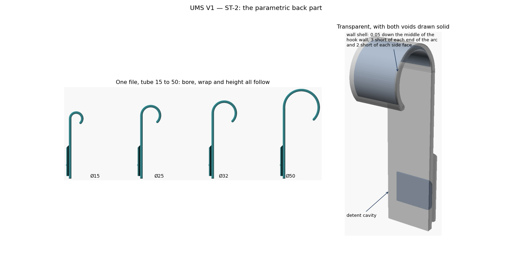

# UMS V1 — ST-2 report: the parametric back part

**September 2026 · `ums_hook.scad`, `lib/ums_hook_lib.scad` v0.1.0 · OpenSCAD 2021.01**

One file now generates a UMS back part for any tube from 15 to 50, or a flat
plate on screws. It carries the ST-1 rail unchanged, so every V1 front part fits
it.

---

## 1. Delivered

| File | What it is |
|---|---|
| `ums_hook.scad` | The Customizer file: part, print, fit, hook, wall shell, rail and plate-mode tabs |
| `lib/ums_hook_lib.scad` | Hook, plate, wall shell and screw geometry |
| `tests/ums_hook_probe.scad` | Fit probe against a front part written in literal V1 numbers |
| `tests/ums_hook_views.scad` | Preview: the part transparent with both voids drawn solid |
| `tests/st2_variants.json` | 14 variants, rendered at 60° and 45° |

---

## 2. The wall shell

> **Revised twice since.** The gap is now **0.15**, because PrusaSlicer fills
> cracks under about 0.098 and at 0.05 the shell did nothing at all; and it now
> runs the **whole length of the part**, not just the arc. See the ST-6 report.

As asked: a **0.05 mm cavity down the middle of the hook wall**, following the
full length of the arc, held back **3 mm from each end** and **2 mm from each
side face**.

It is thinner than a single extrusion, so it is not a void the printer ever has
to deal with. What it does is give the slicer an inner contour to follow, so the
hook comes out as perimeters either side of it rather than infill — the part is
solid-walled even if somebody slices it at 10 % infill by mistake. It is a safety
net against a slicing error, not a structural feature, and the file warns if the
gap is set wide enough to slice as a real void.

Two details fell out of the geometry:

* **It is sealed.** Held back 2 mm from both side faces, it never reaches the
  surface — the part renders as three closed surfaces (outside, detent cavity,
  wall shell) on every tube size. Nothing to clean, nothing to enter.
* **Its ends are pointed.** A flat end face on the shell was 3.2 mm² of ceiling
  in the print orientation and failed the overhang check. The section is now a
  hexagon that comes to a point at each end of the width, so even this hair-thin
  void roofs itself.

`shell_gap`, `shell_end` and `shell_side` are all parameters, and `shell = false`
turns it off.

---

## 3. Geometry decisions

| | |
|---|---|
| Hook built as a **revolve** about the tube axis | The chamfer at each side face then falls straight out of the section. The obvious route — extruding the C across the width with `uh_chamfered_extrude` — silently filled the hook solid, because that module hulls between levels and a C is not convex |
| Wall = plate thickness (3.8) | This is what lands the hook's back face exactly on the rail root plane, so hook and plate merge with no step. V1 does the same, which is why both are 3.8 |
| Bore tangent to the back of the plate | Straight from the V1 measurement: bore centre sits `r + wall` in front of the rail root plane |
| `rail_clear` 30 | Gap between hook and rail top, measured off V1's single hook |
| Plate carried 0.5 past the tube centre | So plate and hook overlap instead of meeting tangentially. Two tangencies — this one and the tip cap — each left a degenerate edge and failed the manifold check until they were overlapped |
| No teardrop on the bore | Printed on its side the bore stands vertical. Design-plan Q3 is moot |

---

## 4. Verification

* **30 renders** (15 variants × 60° and 45°), all **PASS** in the print
  orientation — tubes 15, 19, 25, 32, 40, 50, both tip angles, shell on and off,
  rigid detent, V1-length rail, and the plate mode with two and three screws.
* **The interface still measures V1 exactly** on the whole hook, not just on a
  coupon: rail height 4.000, tip 31.000, root 26.034, flank 2.483 at 45.000°,
  seat 4.000 at 45.000°, bump 27.000 below the tip face top, flanks mirrored to
  0.000.
* **Fit against a real V1 front part**: `probe` **empty**, so nothing on the hook
  intrudes into the socket. `snap` is **0.137 mm³** — the detent and nothing
  else.
* **Three sealed closed surfaces** on every tube size.

The checker needed two fixes to work on a whole part rather than a coupon: the
rail tip face is now found as the furthest −Y plane rather than the largest (on a
hook the plate's own front face is bigger), and the root plane is read off the
flank rather than searched for.

---

## 5. Open items

1. **Rail length: 48 everywhere — decided.** `UMS_LEN_STD` is 48 and it is the
   default on every new part; V1's own 38 stays in the file as `UMS_LEN` and is
   what compatibility is measured against. The console no longer treats 48 as a
   deviation. At 38 the cavity is dropped and the bump goes rigid, with a
   warning naming the length needed.

---

## 6. The flat plate

Same rail, same detent, no latch. Two screws Ø5 countersunk on the **front**
face, 62 apart on a 76 × 31 × 8.4 plate.

The screws had to move. They were through the rail, which does not work now that
the rail's tip skin is the detent membrane: an M5 head needs about 10 mm of clear
length and the cavity leaves only 7 below it, so a head would have broken into
the sealed cavity. They now sit above and below the rail, on plate that is clear
of it, which also spreads them the length of the plate instead of bunching them
in the middle — that is what carries the moment of a device hanging off the
front. The seal is checked: the plate renders as two closed surfaces, so nothing
has punctured the cavity.

The head is on the front face, the screw exits at the wall. That needed the
cutter turning round: `uh_screw_hole` puts the head at the far end of its own
frame, because in the UniHolder screws go in from inside the box, so taking it at
face value put the countersink against the wall. Measured back off the STL, the
hole is now Ø11.6 at the front and Ø5.8 at the back.

| | |
|---|---|
| Plate | 76 × 31 × 8.4 |
| Screws | 2 × Ø5, countersunk front, 62 pitch, clear of rail and cavity |
| Verification | interface measures V1 exactly; probe against a real V1 front part empty; two sealed surfaces; passes at 60° and 45° |
