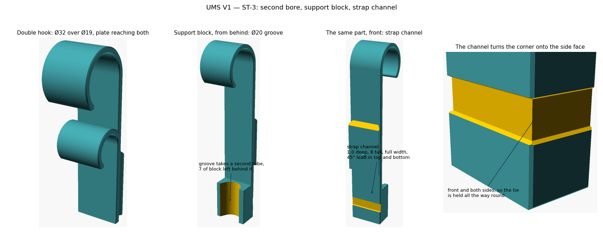

# UMS V1 — ST-3 report: second bore, support block, strap

**September 2026 · `ums_hook.scad` + `lib/ums_hook_lib.scad` · OpenSCAD 2021.01**

Everything V1's Double hook extended and Hook with support carry is now a
parameter on the same file.

---

## 1. What was measured, and where it came from

V1's own numbers, converted into the part frame (V1 assembly y − 56.2, z − 80):

| Feature | V1 | Implemented as |
|---|---|---|
| Support block | y 1.0–17.0, z −55 to −19, 29 wide | `sup_depth` 17, `sup_len` 36, `sup_drop` 19, `sup_w` |
| Groove in its face | Ø20 half round, vertical axis, 6 of block left behind it | `notch_d` 20, teardropped |
| Strap channel | 1.0 deep, 8 tall, full width, 45° lead-ins, front face only | `strap_t`, `strap_w`, `strap_z`, plus `strap_sides` and `strap_back`, which V1 has no equivalent of |
| Second bore | Ø19, centre 44.8 below the Ø32 | `tube_d2`, `hook2_drop` (auto gives 45.1) |

---

## 2. One change from V1, deliberately

**The support block is full width, 31, where V1's is 29.** Laid on its side —
which is how these print — a 29 mm block on a 31 mm plate leaves its underside
hanging 1 mm over the bed: **438 mm² of flat face with nothing under it**. That
is the single biggest unsupported area anywhere in the V1 set and it is why Hook
with support was the one hook that did not come out at 0 mm² in the orientation
study. At full width the block lands on the bed with the plate and the figure
goes to zero. `sup_w` still goes down to 10 and warns when it does.

The groove is teardropped for the same reason: it is a horizontal hole once the
part is on its side, so its crown is raised to a ridge. The tube seats on the
sides of the groove either way.

---

## 2b. The strap channel now wraps

The channel runs across the front face and **down both side faces**, so a tie is
held all the way round the section rather than only where it crosses the front.
`strap_back` adds the fourth run for a tie that wraps a bare plate instead of a
tube. Measured off the STL: each side groove is 1.0 deep, floor 8.0 wide,
running the full 17 of block depth, flared to 9.0 at the surface by the same 45°
lead-ins as the front.

**The groove in the bed face is a bridge**, 8.0 mm across and 16 long, and that
is accepted. The checker can now tell the difference rather than just failing:
`check_overhang --bridge-span` groups violating facets, takes the short way
across each group as the span, and probes just outside both ends at the height
of the ceiling to ask whether there is wall on each side. A ceiling with walls
both sides and a short span is a bridge; one hanging off a single edge is not.

It discriminates, which is the point: the strap groove is classed as a bridge
and the part passes, while the 29 mm support block from section 2 — 438 mm²
floating over the bed with nothing beside it — still fails with the same
allowance in force.

---

## 3. Verification

* **23 variants pass at 60°**, and the eight new ones pass at **45°** too:
  Ø32+Ø19, Ø50+Ø25, a deliberately tight pair, support alone, support with
  strap, strap alone, a deep block with a Ø32 groove, and all of it at once.
* **Strap channel measured off the STL**: floor at y = 1.00, 31.0 wide,
  z −41.0 to −33.0 = **8.0 tall**. Clears a 6 mm tie with a millimetre to spare;
  the file warns if `strap_w` is set within 1 mm of the tie width.
* **Second hook spacing** auto-computes to 45.1 against V1's 44.8.
* **Strap side grooves**: front, both sides and the optional back all pass at
  60° and 45° with `--bridge-span 12`; the only thing that allowance covers is
  the 8 mm bed-face groove.
* Interface, seal and V1 fit all unchanged from ST-2.

One artefact worth naming so nobody chases it later: double-hook variants report
a worst overhang of about 89°, with a violating area of 0.000 mm². Those are
single sliver facets of about 0.0001 mm² where the second hook meets the plate.
Filter slivers out and the count is zero. The verdict is driven by area, not by
that headline number.

---

## 4. Parameters added

| Tab | Parameters |
|---|---|
| Second hook | `tube_d2` (0 = none), `hook2_drop` (0 = auto) |
| Support block | `support`, `notch_d`, `sup_depth`, `sup_len`, `sup_drop`, `sup_w` |
| Strap | `strap`, `strap_tie_w`, `strap_w`, `strap_t`, `strap_z` (0 = auto, centred on the block) |

The plate now reaches whatever hangs off it — tail, second hook or support
block, whichever goes lowest — so no combination leaves a hook or a block
floating off the end of it.

---

## 5. Open

1. Both hooks open the same way. V1's do too. If a context ever needs the
   second one reversed, it is one parameter.
2. The strap works without the support block (`strap_only` variant), which V1
   has no equivalent of, but it costs nothing and may be useful for tying a hook
   to a frame directly.

Next: **ST-4** — the vertical pole clip. Note that one prints standing, not on
its side, so it takes the across-the-rail spring rather than the sealed cavity.
