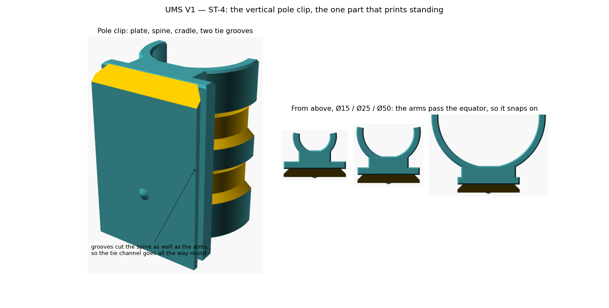

# UMS V1 — ST-4 report: the vertical pole clip

**September 2026 · `lib/ums_pole_lib.scad` v0.1.0 · OpenSCAD 2021.01**

`attach = "pole"` gives a clip that snaps onto a vertical pole from 15 to 50 and
carries the same rail as every other back part.

---

## 1. It is the one part that prints standing

Measured on V1's Vertical attachment 25, unsupported area above 60°: **434 mm²
standing, 713 flat, 999 on its side.** The hooks are the other way round. The
reason is the same in both cases — the bore wants to be vertical — and for this
part the bore already is.

That changes one thing inside the rail. Standing, layers stack along **z**, so
the detent membrane has to bend about a horizontal axis in **x**, not in z.
`ums_rail_cutters(up = "z")` turns the same sealed cavity a quarter turn about y,
which swaps its width and its length and carries the self-roofing ridge round to
the top with it. Same cavity, same 8.35 mm span, same 1.03 % strain, same 0.6
membrane — only its orientation differs.

---

## 2. Geometry

| | |
|---|---|
| Cradle | revolve about the pole axis, so the C is never hulled shut and the bed chamfer falls out of the section |
| Wrap | 200° default: the arms pass the equator by 10°, so the mouth is narrower than the pole and it snaps on |
| Snap | Ø25 spreads the arms **0.38 mm** to take the pole; the file reports it for any size |
| Wall | 3.5, V1's figure for this part, thinner than a hook's 3.8 |
| Standoff | 8.8 from the rail root plane to the near side of the bore, from V1 |
| Spine | width auto = 2·√(ro²−ri²), which is exactly how wide the arms are where the bore is tangent |
| Tie grooves | 2 by default, 6 tall, 2 deep, 45° lead-in top and bottom |

**No separate tie slot.** The groove is a full revolve, so where it passes the
back of the clip it cuts through the spine as well and the channel is already
continuous all the way round; the spine stays joined above and below it. Two
earlier attempts at a separate slot are worth recording because both failed the
checks for reasons that will come up again:

* A **peaked** slot roof leaves a knife edge hanging in mid-air. Its faces are
  within the overhang limit, so P2 passes, but P3 correctly calls the apex a
  floating minimum.
* A **flat** slot roof makes every vertex along the ceiling a local minimum, so
  P3 flags the lot. The bridge allowance added in ST-3 only relaxes P2.

The groove's lead-in needed fixing too: running the cutter 1 mm past the surface
in radius alone turned a 45° lead-in into 56°, because the extra millimetre
lengthened the run without raising the rise. The cutter now oversteps in both.

---

## 3. Verification

* **22 renders** (11 variants × 60° and 45°), all pass: Ø15, 20, 25, 32, 40, 50,
  wraps of 180 and 230, two and three tie grooves, no grooves, and a rigid
  detent. Worst overhang 45.0–60.0 depending on the limit, zero P2, zero P3,
  manifold throughout.
* **Interface measures V1 exactly** on the finished clip, and `probe` against a
  front part written in literal V1 numbers is **empty**.
* **Two closed surfaces** — the detent cavity is sealed in this orientation too.
* Tie count is clamped to what fits: at 48 of rail, three 6 mm grooves would have
  touched and left 50 non-manifold edges, so the third is dropped with a warning.
* `pole_wrap = 180` renders and passes, and warns that nothing holds it on.

---

## 4. Open

1. The clip's plate runs the height of the rail, 48. V1's was 38 with a 30 mm
   cradle. Nothing says it has to match the rail — if a shorter clip is wanted,
   the cradle's own height should become a parameter.
2. The default wrap is 200° against V1's measured 201°. Rounded deliberately;
   say if you want the exact figure.
3. The snap force depends on wall, wrap and material, and is the same kind of
   question as the detent force: it wants a printed part rather than arithmetic.

That closes ST-4. Remaining: **ST-5**, the front blank and the UniHolder adapter,
then **ST-6** for docs, print-ready STLs and the datasheet.
