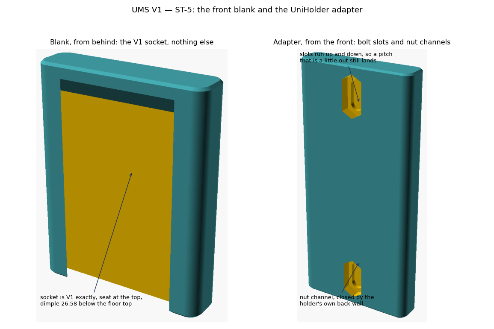
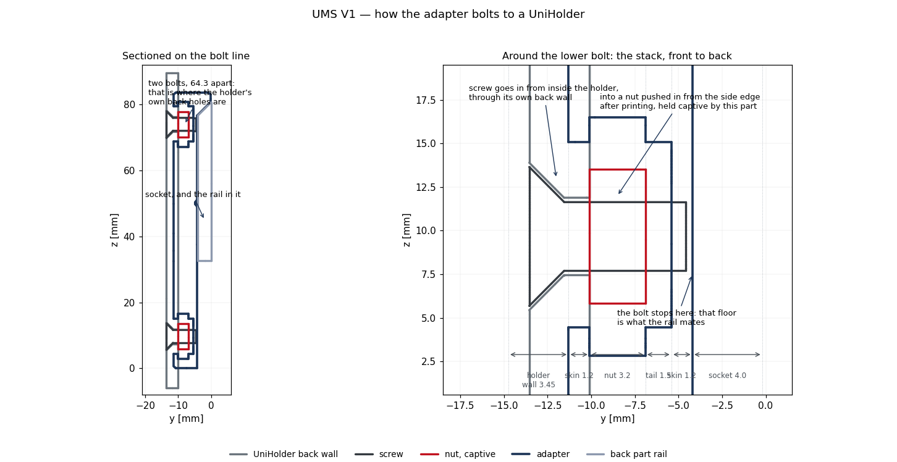

# UMS V1 — ST-5 report: the front blank and the UniHolder adapter

**September 2026 · `ums_front_blank.scad` · OpenSCAD 2021.01**

The front side of the interface: a blank carrying the V1 socket, and the same
blank with a bolt pattern that fixes it to a UniHolder. **The UniHolder is not
modified.** The adapter is a separate printed part that bolts through the
holder's existing back holes, the method the DIN clip uses.

---

## 1. The socket is V1, measured

| | measured | V1 |
|---|---|---|
| Mouth offset from the root plane | 0.200 | 0.20 |
| Depth | 4.000 | 4.00 |
| Mouth width | 27.000 | 27.00 |
| Floor width | 35.000 | 35.00 |
| Flank angle | 45.000° | 45° |
| Seat ramp | 4.000 at 45.000° | 4.00 at 45° |
| Dimple | Ø2.298 × 0.700 | Ø2.30 × 0.70 |
| Dimple below the floor top | 26.580 | 26.58 |
| Flank mirror error | 0.000 | 0.00 |

`probe` against a rail written out in literal V1 numbers is **empty**, and the
detent interference is **0.130 mm³** — the same figure the back parts give.

Front parts print **standing**, as V1's own do: unsupported area above 60° is
0.1 to 29 mm² standing against thousands any other way, measured on the three V1
holders. The socket is then a vertical slot and its closing ramp is the only
overhang.

---

## 2. Where the UniHolder's back holes actually are

Rendered at four heights and measured off the mesh, the holes sit on the
centreline at **9.67 from the bottom and 6.02 from the top**:

| holder size_z | lower hole | upper hole |
|---|---|---|
| 60 | 9.67 | 53.98 |
| 80 | 9.67 | 73.98 |
| 100 | 9.67 | 93.98 |
| 120 | 9.67 | 113.98 |

So the pitch is `holder_h − 15.69`, and the adapter derives it from `holder_h`
unless an explicit `pitch_z` is given. That swing is far too large for slots to
absorb on their own — 60 mm between a short holder and a tall one — which is
worth being plain about: **the slots are for tolerance, not for guessing.**

`tools/check_bolt_pattern.py` measures both parts and reports the fit:

| case | result |
|---|---|
| Adapter built for 60, 80, 100, 120 against those holders | **PASS**, 3.00 mm of travel left in each slot |
| Holder set to a 30 pitch, adapter 51 tall standing 20 up it | **PASS**, both holes land |
| Adapter built for 80, used on an 82 | **PASS**, 1.00 left |
| Adapter built for 80, used on an 84 | **FAIL**, 0.65 short |

So `slot_travel` of 6 lets the bolt's centre move **±3 mm**, which covers a
holder about 4 mm off what the adapter was set for. Raising `slot_travel` buys
more, one for one.

> **Corrected after ST-7.** The figures first published here — 7.04 mm of play,
> and a holder 12 mm off still landing — were wrong twice over. The checker was
> measuring to the ends of the slot rather than to where the bolt's own diameter
> stops it, which overstates the travel by a bolt radius at each end; and at
> that time it was finding the nut channel, which opened at the same face and is
> larger, instead of the bolt slot. Both are fixed: the channel is now internal,
> so only the slot is there to find, and the tool reports the travel the bolt
> actually has.

---

## 3. The fixing stack, and when the nut goes in

**The nut is pushed in after printing, from the side edge. Nothing is inserted
mid-print**, which would need a pause and a careful operator — not something to
ask of field production.

Front to back: **socket 4.0, skin 1.2, nut 3.2, bolt tail 1.5, skin 1.2 — 11.1
total.** Screws go in from inside the holder, through its own back wall, through
1.2 of this part, and into the nut.

The nut sits in a hexagonal pocket on the bolt axis, elongated upwards so it
follows the slot, with its flats bearing on the pocket's vertical walls so it
cannot turn while the screw is tightened. A channel from the side edge lets it
be pushed in. **It is closed toward the holder**, so the nut is captive in this
part on its own: nothing has to be held in place while the two are lined up, and
the nut cannot fall out or slide away while you drive the screw.

`fix = pilot` drops the nut altogether for a self-tapping screw, which is 3.5 mm
thinner and simpler to assemble, at the cost of not taking repeated removal.

The bolt hole is blind and stops clear of the socket floor, because that floor is
the face the rail mates. The first version ran it straight through into the
socket.

---

## 3b. Why the adapter is as tall as it is

An adapter set for an 80 mm holder comes out **83.65 tall** for a 48 mm rail,
which looks wrong until you see where the holes are: the holder's own back holes
sit near its two ends, 64.3 apart, so anything bolting to both has to span them.

There are two ways to make it shorter, neither of which touches the UniHolder's
design:

* **Set the holder's own `back_hole_pitch_z`.** At 30 its holes move to 26.83
  and 56.83, and a **51 mm** adapter reaches both — with its foot standing 20 up
  the holder rather than flush with it.
* **Mount the adapter partway up.** `bolt_z0` is the height of the lowest bolt
  above the adapter's own foot, so the part can sit anywhere on the holder.

---

## 4. Five things the checks caught

* **The bolt hole broke into the socket**, as above — found by the overhang
  check picking up the breakthrough edge, not by eye.
* **The cutters were upside down.** `rotate([-90,0,0])` carried the profile's
  +y to −z, so the slot's teardrop and the nut's point faced downward: every
  hole had an unsupported roof. The same rotation runs the extrusion the right
  way too, so both cutters now start at their blind end.
* **The bolt pattern was centred on the adapter, not registered to the holder.**
  It lined up at the default sizes only because the auto-sized body happened to
  put its centre in the same place as the holder's. Setting the holder's own
  pitch to 30 broke it by 6.6 and 9.3 mm, which the bolt-pattern check caught the
  first time it was run on anything other than the default. Bolts are now placed
  from the foot up, through `bolt_z0`.
* **The nut pocket opened the wrong way.** It faced the holder, so the nut was
  only captive once the two were bolted together — until then it fell straight
  out, and it could slide along the channel while the screw was being driven.
  Found by drawing the assembly, not by any check. Rebuilding it as a side-entry
  T-slot turned up two more orientation errors, both caught by probing points
  against the geometry rather than by eye: the hexagon was lying in the wrong
  plane, which made the pocket 8 mm deep front to back instead of 3.2, and the
  entry channel's peak pointed forward into the skin instead of up.
* **The bed chamfer clipped the seat ramp** to 3.7 where it should be 4.0, which
  `check_interface` flagged. The body now carries `top_margin` of 3 above the
  seat, which is about what V1's own front parts carry.

---

## 5. Verification

* Blank and adapter both **pass at 60° and 45°**, zero P2, zero P3, manifold.
* **Nine point probes** into the adapter confirm the fixing does what it claims:
  skin in front of the nut except on the bolt axis, pocket open at the side edge
  and closed on the far side, pocket elongated in z, skin between the bolt tail
  and the socket floor, and no channel anywhere a bolt is not.
* Socket measures V1 on every line; probe against a literal V1 rail empty.
* Bolt pattern matches real UniHolders at four heights, with the play measured
  rather than assumed.

---

## 6. Open

1. The holder's default is a **single column** of holes, so `cols > 1` needs an
   explicit `pitch_x`. The file takes it; nothing derives it.
2. The adapter stands the holder about 9.9 off the rail root plane. If that
   proves too far forward in use, `fix = pilot` saves 3.5.
3. Nut size is a parameter, not a standard: `nut_af` 7.0 is M4, 8.0 is M5.

Next: **ST-6** — README, print-ready STLs, preview images, the single-file
Customizer versions, and the datasheet rows for the new parts.
