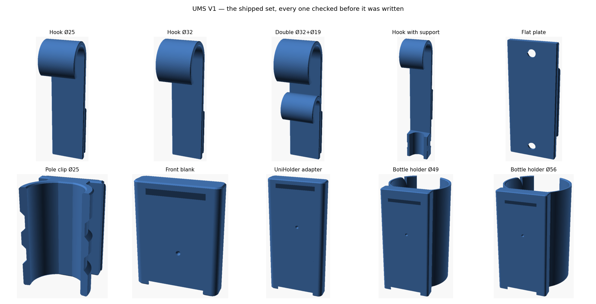

# UMS V1 — ST-6 report: packaging, and the final gate

**September 2026 · OpenSCAD 2021.01**

---

## 1. Delivered

| | |
|---|---|
| `dist/ums_hook.scad`, `dist/ums_front_blank.scad` | Single-file builds, libraries pasted in, Customizer ready |
| `dist/stl/` | Ten print-ready parts, each oriented the way it prints |
| `docs/previews/` | A render of each |
| `docs/UMS_V1.1_datasheet.md` | Datasheet in the V1 template |
| `README.md` | Rewritten: start here, printing, file map, how to check |
| `tools/make_dist.py`, `tools/check_dist.py` | Build the single files; gate the shipped STLs |

---

## 2. The single-file build is proved, not assumed

A Customizer will not follow an include, so each top-level file is rewritten with
its libraries pasted in where the include stood. That is easy to get subtly
wrong, so `make_dist.py` renders **every variant in every matrix** from both the
multi-file source and the single-file build and compares the two meshes facet for
facet, sorted so the comparison does not depend on ordering.

Result: **44 variants, all identical.** The build also records a fingerprint of
the sources it was made from, so a stale `dist/` can be spotted.

---

## 3. The final gate

`check_dist.py` takes every file in `dist/stl`, rotates it into its own print
orientation, and asks three things: does it still carry a true V1 interface, does
it print clean, and does it have exactly the sealed voids it should.

| Part | interface error | closed surfaces | 60° |
|---|---|---|---|
| Hook Ø19, Ø25, Ø32 | 0.006 | 3 | pass |
| Double hook Ø32+Ø19 | 0.006 | 3 | pass |
| Hook with support and strap | 0.006 | 3 | pass |
| Flat plate | 0.006 | 2 | pass |
| Pole clip Ø25, Ø32 | 0.006 | 2 | pass |
| Front blank | 0.000 | 1 | pass |
| UniHolder adapter | 0.000 | 1 | pass |

Three closed surfaces on a hook is the outside, the detent cavity and the wall
shell; two on a plate or clip is the outside and the detent cavity; one on a
front part is just the outside, which is what it should be.

The shipped files are built at the 60° default and are held to 60° here — a part
built for 60 has 60° features by design. The variant matrices are what prove the
sources also come out clean at 45.

---

## 4. What the gate caught

* **The dimple was a sealed void, not an opening.** It met the socket floor
  exactly on a plane rather than overlapping it, so the front blank rendered as
  two closed surfaces instead of one. Lifting the dimple 0.01 into the groove
  fixed it. The shell count is what found this; no dimensional check would have.
* **The socket's detent window was catching the bolt hole.** On the adapter, the
  hole behind the socket floor is also a feature past that plane, and only its
  depth tells it from the dimple. The window is now 1.0 for a socket and 1.5 for
  a rail.
* **The first gate checked shipped parts at 45°** and failed three of them on
  features that are 60° by design. Corrected, with the reasoning written down so
  it does not come back.

---

## 5. Where the project stands

Every stage is closed. Geometry is verified end to end: the interface measures V1
on every part, every part fits a front part written out in V1's own numbers, the
detent clicks 0.31 mm, the adapter's slots land on real UniHolders at four
heights, and nothing in the shipped set needs support.

What has **not** happened is a printed part. Everything above is geometry and
arithmetic. Three things want a real print before this goes near a patient
environment:

1. **Snap force.** The detent is computed at about 13 N to push flush and 1.03 %
   membrane strain. Both are model numbers.
2. **The 0.9 membrane.** Two full perimeters on a 0.4 nozzle, sitting where the socket floor
   never touches it, but thinner than the 1.2 minimum wall used everywhere else.
   A deliberate exception that wants confirming in PETG. Raised from 0.6 in ST-8
   after a print showed the gap fill on the face.
3. **The two sealed voids**, for the IPC advisor: nothing can enter either, but
   V1 has no cavities at all and this adds two.

Then the datasheet's readiness numbers can move, and `Product tested by` can be
signed.

---

## 6. Revision: the wall shell was invisible to the slicer

**Reported from a real slice, not from a check.** The 0.05 mm shell is in the
geometry — measured at 0.057 on the wall's mid radius, spanning the arc — but
PrusaSlicer never showed it, so it was doing nothing.

The cause is a slicer setting, not the model. PrusaSlicer fills cracks narrower
than **twice its slice gap closing radius**, which defaults to 0.049 mm, so
anything under about **0.098 mm** is closed before perimeters are generated. At
0.05 the shell vanishes without trace.

The default is now **0.15**, not 0.1: 0.1 sits two microns above that threshold,
which is inside the faceting tolerance of the arc itself — the shell measures
0.057 rather than 0.050 for exactly that reason. 0.15 clears it with margin and
is still well under one extrusion, so nothing is printed into it. The file warns
below 0.12 and above 0.3, and `shell_gap` remains a parameter if you want to
trade margin for a thinner crack. If you would rather keep 0.05, the alternative
is to lower the slicer's gap closing radius to about 0.02.

Measured after the change: **0.155 to 0.157** on every shipped hook, on the
correct mid-wall radius for its bore.

### The shell now runs the whole length, not just the curve

It followed the arc of the hook and stopped there, leaving the plate — most of
the part — with nothing. It now runs from 3 mm inside the free tip of the hook,
round the arc, and straight down the middle of the plate to 3 mm above its foot.

The two runs meet exactly, without being made to: at the tube centre the hook's
wall spans precisely the plate's own two faces, which is the same property that
makes hook and plate merge with no step, so the mid-wall of one is the
mid-thickness of the other. The arc is carried four degrees past that point so
the two overlap rather than meeting on a plane.

Measured on the shipped hooks, the shell now spans:

| Part | shell runs | part spans |
|---|---|---|
| Hook Ø19 | −1.00 to 102.77 | −4.00 to 104.60 |
| Hook Ø25 | −1.00 to 108.77 | −4.00 to 110.60 |
| Hook Ø32 | −1.00 to 115.77 | −4.00 to 117.60 |
| Double Ø32+Ø19 | −1.00 to 115.77 | −4.00 to 117.60 |
| Hook with support | −52.00 to 115.77 | −55.00 to 117.60 |

3 mm short at each end, by design, and 2 mm short of each side face, so it stays
sealed.

### And a gap the check found while confirming it

**The second hook on a double never had a shell.** Only the first bore was ever
given one, so the lower hook of a Double hook extended was relying on infill.
Fixed: `ums_wall_shell_at` takes a bore directly, and the second hook gets its
own. Now that the plate run joins them, a double renders as **three closed
surfaces** — the outside, the detent cavity, and one continuous shell through
both hooks and the plate between them.
