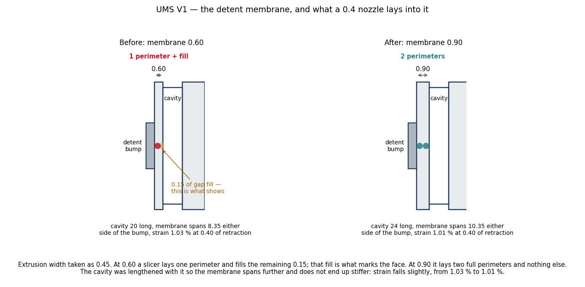

# UMS V1 — ST-8 report: the detent membrane

**September 2026 · `lib/ums_iface.scad` · OpenSCAD 2021.01**

Reported from a print, not from a check: the membrane over the sealed cavity was
**0.60** thick, and a 0.4 nozzle lays one perimeter into that and fills the rest.
The fill marks the face of the rail, right where the front part slides over it.

---

## The change

| | before | after |
|---|---|---|
| Membrane | 0.60 | **0.90** |
| What a 0.4 nozzle lays | 1 perimeter + 0.15 of fill | **2 full perimeters** |
| Cavity length along the rail | 20.00 | **24.00** |
| Membrane span either side of the bump | 8.35 | 10.35 |
| Strain at 0.40 of retraction | 1.03 % | **1.01 %** |
| Click against an unmodified V1 socket | 0.313 | 0.313 |

**The cavity was lengthened with the membrane, not after it.** A thicker
membrane over the same span would be stiffer by the cube of the thickness and
would strain half again as hard — 1.55 %, past what PETG takes. Spanning 10.35
instead of 8.35 puts the strain back where it was, slightly under it. Nothing
about the detent's position, diameter or travel moved, so the click is
unchanged: 0.313 mm, measured against a socket written out in V1's own numbers.

24 fits the rail: at 48 long the cavity has 29 of room between the detent and
the seat, and the pole clip — which turns the cavity a quarter turn because it
prints standing — needs 26 across the rail's 26 of usable width. Both hold.

`ums_hook.scad` now warns below 0.8, which is where the second perimeter stops
fitting.

---

## Verification

* **ST-2 15/15, ST-3 23/23, ST-4 11/11** at 60°, and the hook at 45° as well.
* Interface still measures V1 to 0.006 on every part; three closed surfaces on a
  hook, two on a plate or clip.
* **Click 0.313 mm**, unchanged, and the coupon's snap check still passes its
  0.15 minimum.
* All twelve shipped parts through the final gate.

The 0.9 figure assumes a 0.45 extrusion width, which is what a 0.4 nozzle gives
at default settings. A shop running 0.42 gets two perimeters and a hair of fill;
one running 0.5 gets two perimeters exactly at 1.0. `memb_t` is a parameter, and
the warning marks the floor.
